# Technical Applications Workshop: Modern Cloud Apps Challenge

July 2022

- [Technical Applications Workshop: Modern Cloud Apps Challenge](#technical-applications-workshop-modern-cloud-apps-challenge)
  - [Abstract and learning objectives](#abstract-and-learning-objectives)
  - [Overview](#overview)
  - [Requirements](#requirements)
  - [Solution architecture](#solution-architecture)
  - [Challenge 0: Environment setup](#challenge-0-environment-setup)
    - [Challenge 0 tasks to complete](#challenge-0-tasks-to-complete)
    - [Challenge 0 success criteria](#challenge-0-success-criteria)
  - [Challenge 1: Create Key Vault secrets and add to App Configuration](#challenge-1-create-key-vault-secrets-and-add-to-app-configuration)
    - [Challenge 1 tasks to complete](#challenge-1-tasks-to-complete)
    - [Challenge 1 success criteria](#challenge-1-success-criteria)
  - [Challenge 2: Deploy the e-commerce application to Azure App Services](#challenge-2-deploy-the-e-commerce-application-to-azure-app-services)
    - [Challenge 2 tasks to complete](#challenge-2-tasks-to-complete)
    - [Challenge 2 success criteria](#challenge-2-success-criteria)
  - [Challenge 3: Setup SQL Database Geo-Replication](#challenge-3-setup-sql-database-geo-replication)
    - [Challenge 3 tasks to complete](#challenge-3-tasks-to-complete)
    - [Challenge 3 success criteria](#challenge-3-success-criteria)
  - [Challenge 4: Deploy the Call Center admin website](#challenge-4-deploy-the-call-center-admin-website)
    - [Challenge 4 tasks to complete](#challenge-4-tasks-to-complete)
    - [Challenge 4 success criteria](#challenge-4-success-criteria)
  - [Challenge 5: Deploy the payment gateway](#challenge-5-deploy-the-payment-gateway)
    - [Challenge 5 tasks to complete](#challenge-5-tasks-to-complete)
    - [Challenge 5 success criteria](#challenge-5-success-criteria)
  - [Challenge 6: Deploy the Offers API](#challenge-6-deploy-the-offers-api)
    - [Challenge 6 tasks to complete](#challenge-6-tasks-to-complete)
    - [Challenge 6 success criteria](#challenge-6-success-criteria)
  - [Challenge 7: Add API endpoint configuration settings](#challenge-7-add-api-endpoint-configuration-settings)
    - [Challenge 7 tasks to complete](#challenge-7-tasks-to-complete)
    - [Challenge 7 success criteria](#challenge-7-success-criteria)
  - [Challenge 8: Identity and security (Optional)](#challenge-8-identity-and-security-optional)
    - [Challenge 8 tasks to complete](#challenge-8-tasks-to-complete)
    - [Challenge 8 success criteria](#challenge-8-success-criteria)
  - [Challenge 9: Enable Azure AD B2C for the e-commerce website](#challenge-9-enable-azure-ad-b2c-for-the-e-commerce-website)
    - [Challenge 9 tasks to complete](#challenge-9-tasks-to-complete)
    - [Challenge 9 success criteria](#challenge-9-success-criteria)
  - [Challenge 10: Enable Telemetry with Application Insights](#challenge-10-enable-telemetry-with-application-insights)
    - [Challenge 10 tasks to complete](#challenge-10-tasks-to-complete)
    - [Challenge 10 success criteria](#challenge-10-success-criteria)
  - [Challenge 11: Automating backend processes with Azure Functions and Logic Apps](#challenge-11-automating-backend-processes-with-azure-functions-and-logic-apps)
    - [Challenge 11 tasks to complete](#challenge-11-tasks-to-complete)
    - [Challenge 11 success criteria](#challenge-11-success-criteria)
  - [Challenge 12: Use Twilio to send SMS Order Notifications](#challenge-12-use-twilio-to-send-sms-order-notifications)
    - [Challenge 12 tasks to complete](#challenge-12-tasks-to-complete)
    - [Exercise 12 success criteria](#exercise-12-success-criteria)
  - [Exercise 13: Automate deployments using GitHub actions](#exercise-13-automate-deployments-using-github-actions)
    - [Exercise 13 tasks to complete](#exercise-13-tasks-to-complete)
    - [Challenge 13 success criteria](#challenge-13-success-criteria)
  - [After the challenge](#after-the-challenge)
    - [Tasks to complete](#tasks-to-complete)
  - [References](#references)

## Abstract and learning objectives

In this challenge, you implement an end-to-end Modern Cloud Apps solution using a supplied sample that is based on Azure App Services, Azure Functions, Azure SQL Database, Azure Logic Apps, and other related services. The scenario includes implementing compute, storage, workflows, and monitoring, using various Azure technologies.

Please note that as opposed to the Whiteboard Design Session, the lab is not focused on maintaining PCI compliance and using more advanced security features such as App Service Environment, Network Security Groups, and Application Gateway. The hands-on lab can be implemented on your own, but it is highly recommended to pair up with other members at the lab to model a real-world experience and to allow each member to share their expertise for the overall solution.

By the end of this hands-on lab, you will have learned how to use several key services within Azure to improve overall functionality of the original solution, and to increase the security and scalability of the new and improved design.

## Overview

The Modern cloud apps challenge is a hands-on exercise that will challenge you to implement an end-to-end solution for the Contoso Sports League Association (CSLA) using a supplied sample that is based on Microsoft Azure App Services and related services. The scenario will include implementing compute, storage, security, and scale using various components of Microsoft Azure. The challenge can be implemented on your own, but it is highly recommended to pair up with other members at the challenge to model a real-world experience much closer and to allow each member to share their expertise for the overall solution.

## Requirements

- A Microsoft Azure subscription
- A local or virtual machine configured with Visual Studio 2019 Community Edition or later
- A Twilio account and/or personal cell phone to setup a trial Twilio account
- A GitHub account and local installation of a Git client utility

## Solution architecture

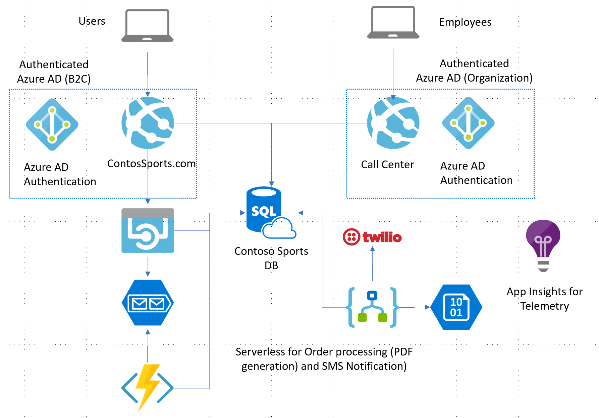

## Challenge 0: Environment setup

**Duration**: 20 minutes

In this challenge, you set up your environment for use in the remaining challenge. You must follow all steps provided.

> **Important**: Many Azure resources require globally unique names. Throughout these steps, `XXXXX` appears as part of resource names. You should replace this with your Microsoft alias, initials, or another value to ensure uniquely named resources.

### Challenge 0 tasks to complete

1. Create an Azure resource group in your subscription.
   - Use `mca-challenge-XXXXX` as the name of the new resource group, where `XXXXX` is a unique suffix, such as your initials or a random number used to ensure a unique resource group name.
2. Run ARM template to provision lab resources.
    - Select **Deploy to Azure** below to launch a custom deployment using an ARM template.
    - On the custom deployment screen in the Azure portal, enter the following:
      - **Subscription**: Select the subscription you are using for this challenge.
      - **Resource group**: Select the resource group you created above from the dropdown list.
      - **Signed In User Object Id**: Enter the Azure AD `ObjectId` for your user account. You can retrieve this value by opening a **Cloud Shell** in the Azure portal and executing the following command: `az ad signed-in-user show --query id -o tsv`.
      - **Username**: Accept the default value, **demouser**.
      - **Password**: Accept the default value, **Password.1!!**.

    <a href ="https://portal.azure.com/#create/Microsoft.Template/uri/https%3A%2F%2Fraw.githubusercontent.com%2Fsolliancenet%2Fchallenge-modern-cloud-apps%2Fmaster%2Flab-files%2Farm-template%2Fazure-deploy.json" target="_blank" title="Deploy to Azure"></a>

    > **Note**: The ARM template will append a hyphen followed by a 13-digit string at the end of resource names. This suffix ensures globally unique names for resources. We will ignore that string when referring to resources throughout the challenges. The resources created by the ARM template include:
    >
    > - [App Service Plan](https://docs.microsoft.com/azure/app-service/overview-hosting-plans)
    > - [Application Insights](https://docs.microsoft.com/azure/azure-monitor/app/app-insights-overview)
    > - [Azure App Configuration](https://docs.microsoft.com/azure/azure-app-configuration/overview)
    > - [Azure App Service](https://docs.microsoft.com/azure/app-service/overview) (Web App)
    > - [Azure Key Vault](https://docs.microsoft.com/azure/key-vault/general/overview)
    > - [Azure Logic App](https://docs.microsoft.com/azure/logic-apps/logic-apps-overview)
    > - [Azure SQL Database](https://docs.microsoft.com/azure/azure-sql/database/sql-database-paas-overview)
    > - [Azure Storage account](https://docs.microsoft.com/azure/storage/common/storage-account-overview)
    > - [Network interface](https://docs.microsoft.com/azure/virtual-network/virtual-network-network-interface) for VM
    > - [Network security group](https://docs.microsoft.com/azure/virtual-network/network-security-groups-overview) for VM
    > - [Public IP address](https://docs.microsoft.com/azure/virtual-network/public-ip-addresses) for VM
    > - [Service Bus namespace](https://docs.microsoft.com/azure/service-bus-messaging/service-bus-messaging-overview)
    > - [Virtual network](https://docs.microsoft.com/azure/virtual-network/virtual-networks-overview) with `default` subnet
    > - [Virtual machine using the Visual Studio 2019 (Latest) Community Edition image](https://docs.microsoft.com/azure/virtual-machines/windows/using-visual-studio-vm), which uses a custom script extension to:
    >     - Disable **IE Enhanced Security Configuration**
    >     - Download the starter solution from Serverless architecture MCW GitHub repo
    >     - Download and install Azure Data Studio
    >     - Download and install Microsoft Edge browser

### Challenge 0 success criteria

1. You have successfully created an Azure resource group and populated it with the services provisioned by the provided ARM template.

    > **Note**: The deployment of the custom ARM template should finish in about 15 minutes. You can monitor the deployment's progress on the **Deployment** blade that opens when you start the ARM template deployment.

## Challenge 1: Create Key Vault secrets and add to App Configuration

**Duration**: 15 minutes

In this challenge, you retrieve various connection string values from resources in your `hands-on-lab-SUFFIX` resource group and use them to create secrets in Key Vault. Additionally, you will create references to the secrets in Key Vault and add them to the App Configuration resource.

### Challenge 1 tasks to complete

1. Create three secrets in Azure Key Vault based on the following table.

    | Secret Name                | Secret Value |
    | -------------------------- | ------------ |
    | AzureQueueConnectionString | Set the value to the primary connection string of the `receiptgenerator` queue in Azure Service Bus. |
    | ContosoSportsLeague        | Set the value to the connection string of the `ContosoSportsDB` Azure SQL Database. |
    | contososportsstorage       | Set the value to the connection string of storage account deployed by the ARM template. |

2. Use [Key Vault references](https://docs.microsoft.com/azure/app-service/app-service-key-vault-references?tabs=azure-cli) to add your secrets to the App Configuration store in your resource group, using the following keys for the secret references:

    | Key                              | Secret to reference        |
    | -------------------------------  | -------------------------- |
    | ConnectionStrings:ReceiptQueue   | AzureQueueConnectionString |
    | ConnectionStrings:SportsDB       | ContosoSportsLeague        |
    | ConnectionStrings:ReceiptStorage | contososportsstorage       |

### Challenge 1 success criteria

1. You have added the three connection string values into Azure Key Vault as secrets.
2. You have entered Key Vault references for each of the three secrets you created into the App Configuration resource in your resource group.

## Challenge 2: Deploy the e-commerce application to Azure App Services

**Duration**: 15 minutes

In this challenge, you deploy the Contoso web app and provide the necessary configuration to display the e-commerce website.

### Challenge 2 tasks to complete

1. Configure the SQL Database firewall to allow access from your local machine.
2. Create a remote desktop connection to the Azure Virtual Machine named `LabVM` using the following credentials:
   - **Username**: demouser
   - **Password**: `Password.1!!`
3. On the `LabVM` virtual machine, open the `Contoso.Apps.SportsLeague.sln` solution in Visual Studio 2019. The solution file can be found in the `C:\MCW\MCW-Modern-cloud-apps-main\Hands-on lab\lab-files\src\Contoso Sports League` folder on the VM. The solution contains the following projects:

    | Project                          | Description  |
    | -------------------------------- | ------------ |
    | Contoso.Apps.SportsLeague.Web    | Contoso Sports League e-commerce application |
    | Contoso.Apps.SportsLeague.Admin  | Contoso Sports League call center admin application |
    | Contoso.Apps.Common              | Shared tier |
    | Contoso.Apps.SportsLeague.Data   | Shared tier |
    | Contoso.Apps.FunctionApp         | Function app tier |
    | Contoso.Apps.SportsLeague.Offers | API for returning list of available products |
    | Contoso.Apps.PaymentGateway      | API for payment processing |

4. Apply the following configuration to the `Contoso.Apps.SportsLeague.Web` project in Visual Studio.
   - Install the latest stable versions of the NuGet packages for `Microsoft.Azure.AppConfiguration.AspNetCore` and `Azure.Identity`.
5. Open the `Program.cs` file and uncomment the following using statements at the top of the file:

    ```csharp
    using Microsoft.Extensions.Configuration;
    using Azure.Identity;
    ```

6. In the `Program.cs` file, locate the `CreateHostBuilder` method and uncomment the following code:

    ```csharp
    webBuilder.ConfigureAppConfiguration((hostingContext, config) =>
    {
        var settings = config.Build();

        config.AddAzureAppConfiguration(options =>
        {
            options.Connect(settings["ConnectionStrings:AppConfig"])
                    .ConfigureKeyVault(kv =>
                    {
                        kv.SetCredential(new DefaultAzureCredential());
                    });
        });
    })
    .UseStartup<Startup>();
    ```

7. Publish the `Contoso.Apps.SportsLeague.Web` app to your Azure App Service Web App.

### Challenge 2 success criteria

1. You have successfully published the `Contoso.Apps.SportsLeague.Web` web application to your Azure App Service.
2. You have validated the deployment by navigating to the URL of the web app and selecting the **Store** link on the menu. You should see product items. If products are returned, then the connection to the database was successful.

    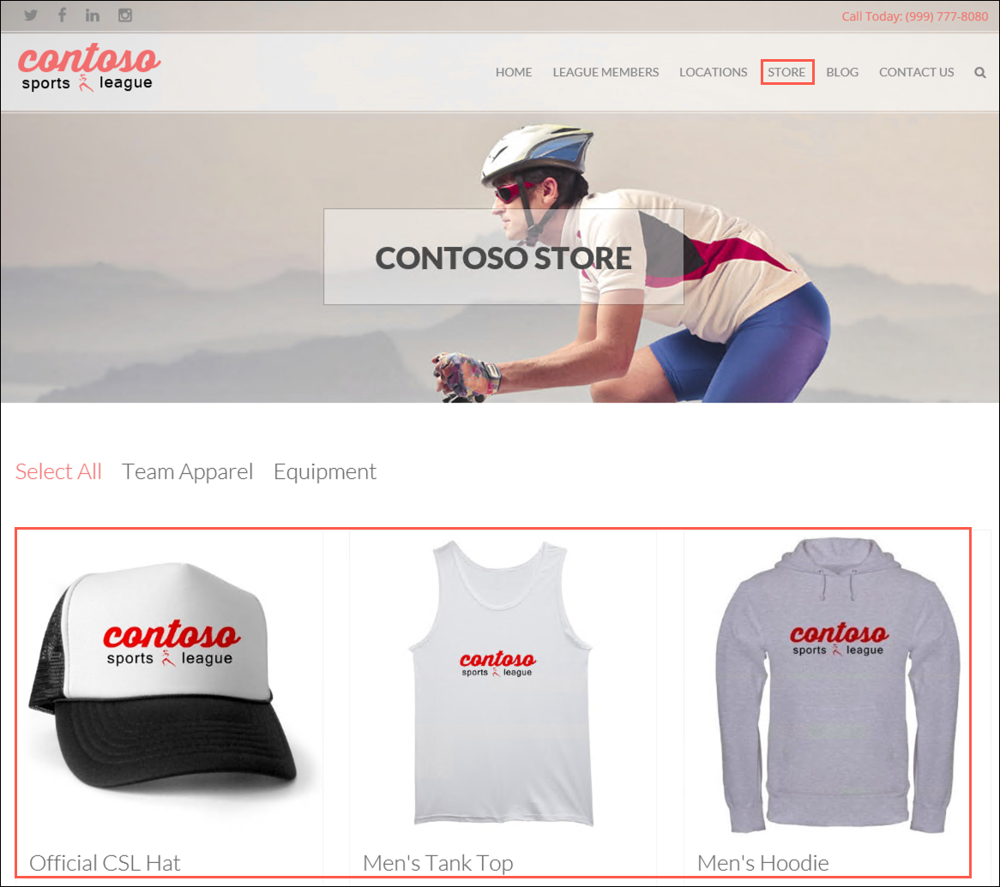

    > **Troubleshooting**: If the web site fails to start up or show products, go back and double check all your connection string entries and passwords in the A settings. If you get a message indicating the Service is unavailable. Give it a moment and refresh your browser.

## Challenge 3: Setup SQL Database Geo-Replication

**Duration**: 45 minutes (15 minutes, if not performing the optional failover)

In this challenge, you provision a secondary SQL Database and configure Geo-Replication. Ensure the new database uses the same resource group created in [Challenge 0](#challenge-0-environment-setup).

### Challenge 3 tasks to complete

1. Create a secondary replica of the `ContosoSportsDB` Azure SQL Database, using the same username and password as you used for the primary. You should also assign the same tier and size as those used for the primary database.
   - **Server admin login**: demouser
   - **Password**: `Password.1!!`

    > **Important**: The secondary Azure Region selected should be the region pair of the region hosting the primary SQL Database. See the [paired regions documentation](https://docs.microsoft.com/azure/best-practices-availability-paired-regions) to verify which region pairs to the location you used for the primary database). Note that if you choose a region that cannot be used as a secondary region, you will receive a validation error.

2. Configure the SQL Database firewall of the secondary replica to allow access from your local machine.
3. Setup a SQL Failover Group to allow a single connection string endpoint to be used by your web applications.

    > With SQL Database Geo-Replication configured, the Azure SQL Failover Groups feature can be used to enable "auto failover" scenarios for the SQL Database. This allows a single connection string endpoint to be used by applications and SQL Database will automatically handle failing over from Primary to Secondary database in the event of a SQL Database outage.

4. Update the `ContosoSportsLeague` database connection string secret in Key Vault with the **Azure SQL Failover Group Read/Write Listener Endpoint** value.

    > **Hint**: You will need to copy the exist secret value and insert the **Azure SQL Failover Group Read/Write Listener Endpoint** value into the existing connection string.
    >
    > ```sh
    > Server=tcp:{failover_group_endpoint},1433;Initial Catalog=ContosoSportsDB;Persist Security Info=False;User ID=demouser;Password=Password.1!!;MultipleActiveResultSets=False;Encrypt=True;TrustServerCertificate=False;Connection Timeout=30;
    > ```

5. Update the Key Vault reference in your App Configuration resource, if necessary.
6. Failover to the secondary SQL database and test the e-commerce website after failover.

    > **THIS TASK IS OPTIONAL**: The replication and failover process can take anywhere from 10 to 30 minutes to complete, so you have the option to skip this task and go directly to [Challenge 4](#challenge-0-deploy-the-call-center-admin-website). However, if you have the time, it is highly recommended that you complete these steps.

### Challenge 3 success criteria

1. You have created a replica of the `ContosoSportsDB` in a paired region.
2. A SQL Failover Group has been created for the `ContosoSportsDB` database.
3. Your application configuration has been updated to use the SQL Failover Group's read/write listener endpoint.
4. [Optional] You have successfully tested the web application after failing over to the secondary replica by navigating to the web app in a browser and loading products into the **Store** page.

## Challenge 4: Deploy the Call Center admin website

**Duration**: 15 minutes

In this challenge, you provision a new Azure App Service for hosting Contoso's Call Center Admin website. After creating the new App Service, you deploy the call center admin website to it from Visual Studio.

### Challenge 4 tasks to complete

1. Provision a new Azure App Service Web App to host the Call Center admin website using the **.NET Core 3.1 (LTS)** runtime stack.
2. Update the new Web App's configuration to use the App Configuration resource for application settings, naming the new connection string setting `AppConfig`.

    > **Hint**: You can use the e-commerce Web App configuration as an example of how this should be configured.

3. Create an Access Policy in Key Vault for new Web App's Managed Service Identity to allow it to read secrets.
4. From Visual Studio on the `LabVM` virtual machine, apply the following configuration to the `Contoso.Apps.SportsLeague.Admin` project in Visual Studio.
   - Install the latest stable versions of the NuGet packages for `Microsoft.Azure.AppConfiguration.AspNetCore` and `Azure.Identity`.
5. Open the `Program.cs` file and uncomment the following using statements at the top of the file:

    ```csharp
    using Microsoft.Extensions.Configuration;
    using Azure.Identity;
    ```

6. In the `Program.cs` file, locate the `CreateHostBuilder` method and uncomment the following code:

    ```csharp
    webBuilder.ConfigureAppConfiguration((hostingContext, config) =>
    {
        var settings = config.Build();

        config.AddAzureAppConfiguration(options =>
        {
            options.Connect(settings["ConnectionStrings:AppConfig"])
                    .ConfigureKeyVault(kv =>
                    {
                        kv.SetCredential(new DefaultAzureCredential());
                    });
        });
    })
    .UseStartup<Startup>();
    ```

7. Publish the `Contoso.Apps.SportsLeague.Admin` app to your new Azure App Service Web App.

### Challenge 4 success criteria

1. You have successfully published the `Contoso.Apps.SportsLeague.Admin` web application to a new Azure App Service Web App.
2. You have validated the deployment by navigating to the URL of the web app. Note that having no data available under Completed Orders is expected at this time.

    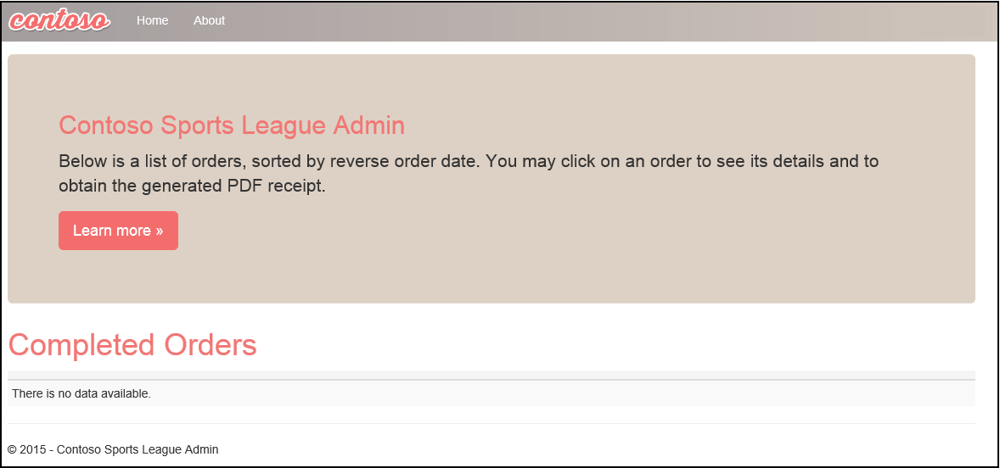

    > **Note**: If you see a page that indicates the app service is running and asking about deploying code, refresh the browser window by selecting `CTRL+F5`.

## Challenge 5: Deploy the payment gateway

**Duration**: 10 minutes

In this challenge, you provision an Azure API App and deploy the payment gateway API to it.

### Challenge 5 tasks to complete

1. Provision an Azure API App for hosting Contoso's Payment Gateway API using the **.NET Core 3.1 (LTS)** runtime stack.
2. Publish the `Contoso.Apps.PaymentGateway` API to the new API App from Visual Studio on the `LabVM` virtual machine.

### Challenge 5 success criteria

1. Navigate to the deployed API URL in a web browser to view the Swagger UI for the API.

    

    > **Note**: If opening the Swagger UI using the Internet Explorer browser you will see a "Resolver error" error message. This is a result of the Swagger UI no longer supporting Internet Explorer. Copy the URL and try opening the page in Microsoft Edge, which has been installed on the LabVM. The Swagger UI will work as expected.

2. Please note the URL of the Payment Gateway API app for future reference.

## Challenge 6: Deploy the Offers API

**Duration**: 15 minutes

In this challenge, you provision another Azure API App and deploy the Contoso Offers API to it.

### Challenge 6 tasks to complete

1. Provision an Azure API App for hosting Contoso's Offers API using the **.NET Core 3.1 (LTS)** runtime stack.
2. Configure Cross-Origin Resource Sharing (CORS) on the new API App, allowing all (`*`) origins.

    > **Important**: You should not do this in a production environment. In production environments, you should enter only the domains you need to allow CORS access to the API as allowed origins. The wildcard (*) is used for this lab to make it easier.

3. Update the new API App's configuration to use the App Configuration resource for application settings, naming the new connection string setting `AppConfig`.

    > **Hint**: You can use the e-commerce Web App configuration as an example of how this should be configured.

4. Create an Access Policy in Key Vault for new API App's Managed Service Identity to allow it to read secrets.
5. From Visual Studio on the `LabVM` virtual machine, apply the following configuration to the `Contoso.Apps.SportsLeague.Offers` project in Visual Studio.
   - Install the latest stable versions of the NuGet packages for `Microsoft.Azure.AppConfiguration.AspNetCore` and `Azure.Identity`.
6. Open the `Program.cs` file and uncomment the following using statements at the top of the file:

    ```csharp
    using Microsoft.Extensions.Configuration;
    using Azure.Identity;
    ```

7. In the `Program.cs` file, locate the `CreateHostBuilder` method and uncomment the following code:

    ```csharp
    webBuilder.ConfigureAppConfiguration((hostingContext, config) =>
    {
        var settings = config.Build();

        config.AddAzureAppConfiguration(options =>
        {
            options.Connect(settings["ConnectionStrings:AppConfig"])
                    .ConfigureKeyVault(kv =>
                    {
                        kv.SetCredential(new DefaultAzureCredential());
                    });
        });
    })
    .UseStartup<Startup>();
    ```

8. Publish the `Contoso.Apps.SportsLeague.Offers` app to the new Azure App Service API App.

### Challenge 6 success criteria

1. Navigate to the deployed API URL in a web browser to view the Swagger UI for the API.

    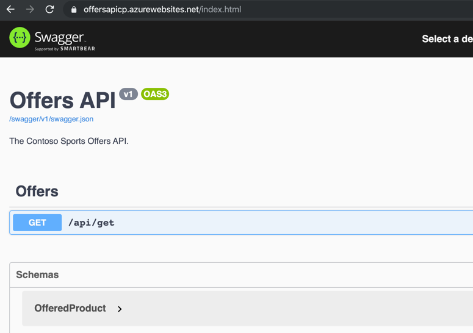

    > **Note**: If opening the Swagger UI using the Internet Explorer browser you will see a "Resolver error" error message. This is a result of the Swagger UI no longer supporting Internet Explorer. Copy the URL and try opening the page in Microsoft Edge, which has been installed on the LabVM. The Swagger UI will work as expected.

2. You can successfully retrieve offers from the API. Call the `/api/get` method on the API from a browser or from within the Swagger UI for the Offers API.

    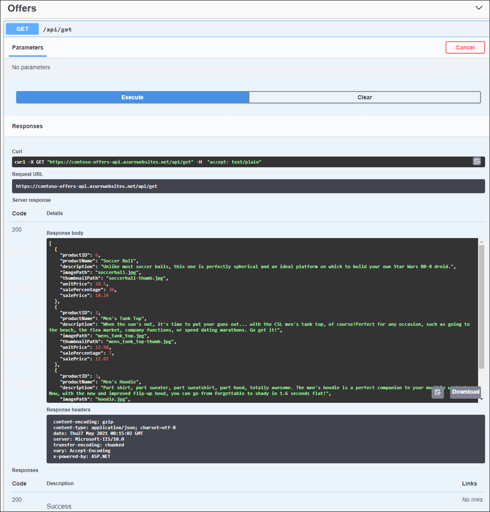

3. Please note the URL of the Offers API app for future reference.

## Challenge 7: Add API endpoint configuration settings

**Duration**: 15 minutes

In this challenge, you add the API endpoints to your App Configuration resource.

### Challenge 7 tasks to complete

1. Add key-value pairs for the new API applications to your App Configuration resource, using the following key-value pairs:

    | Key                      | Value to assign |
    | ------------------------ | --------------- |
    | APIEndpoints:PaymentsAPI | Enter the URL for your Payments API App with `/api/nvp` appended to the end. For example, <https://contoso-payments-api.azurewebsites.net/api/nvp>. |
    | APIEndpoints:OffersAPI   | Enter the HTTPS URL for the Offers API App with /api/get appended to the end. For example, <https://contoso-offers-api.azurewebsites.net/api/get>. |

    > **Important**: Ensure both API URLs are using SSL (https://), or you will get CORS errors.

### Challenge 7 success criteria

1. You have verified the configuration by navigating to the e-commerce website and ensuring the latest offers section of the home page is populated.

    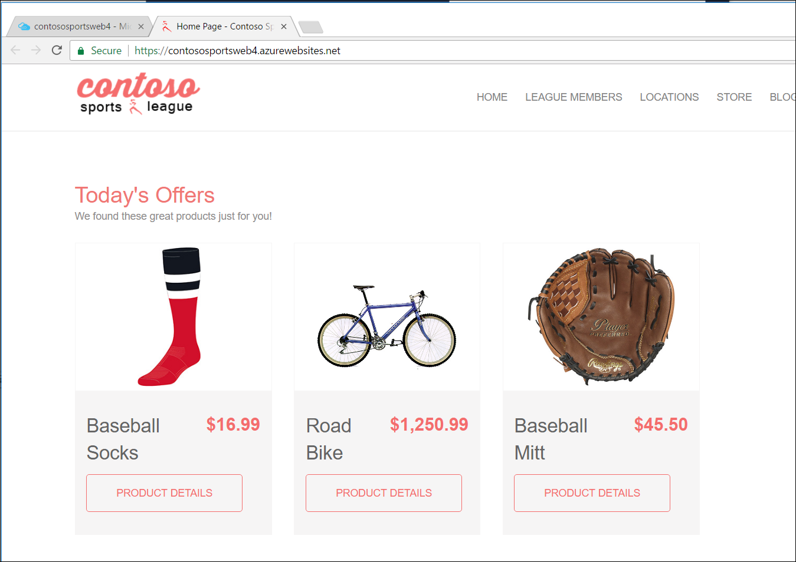

    > **Note**: The page may be cached, if `Today's Offers` are not displayed, **you may need to re-publish the e-commerce application (`Contoso.Apps.SportsLeague.Web`) from Visual Studio on the `LabVM` virtual machine**.

2. You have submit several test orders through the e-commerce website to ensure all pieces of the site are functional. **Accept the default data during the payment processing.**

    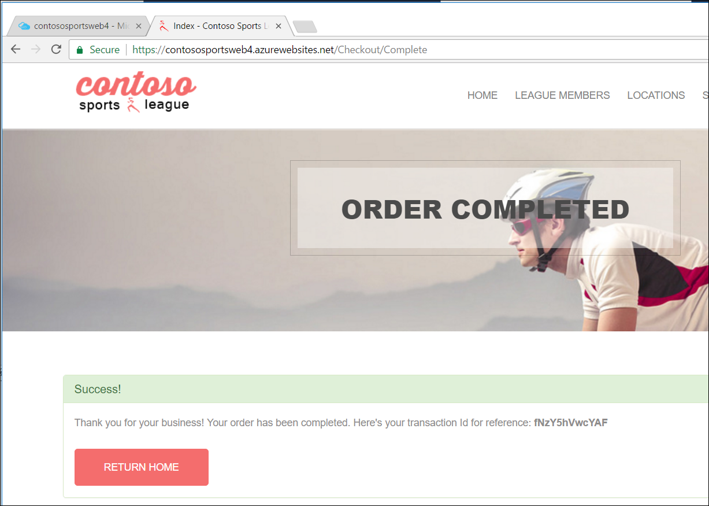

    > **Note**: If you are experiencing CORS errors, review that all URLs in the application configuration resource are correct and are using HTTPS (SSL).

3. You have logged into the Contoso Call Center Admin site and verified the test orders you placed appear on the site.

## Challenge 8: Identity and security (Optional)

**Duration**: 75 Minutes

The Contoso call center admin application should only be accessible to users of the Contoso Active Directory tenant. In this challenge, you create a new Azure AD Tenant and secure the application so only users from the tenant can log on.

> **Important**: This exercise is optional and requires that your account has global admin permissions on the Azure AD Tenant associated with your subscription.

### Challenge 8 tasks to complete

1. [Optional] Enable Azure AD Premium Trial. If you already have a Premium Azure Active Directory, skip to the next task.

    > **Note**: This task is optional and valid only if you are a global administrator on the Azure AD tenant associated with your subscription.

2. [Optional] Create a new Contoso user.

    > **Note**: This task is optional and valid only if you are a global administrator on the Azure AD tenant associated with your subscription.

3. [Optional] Configure authentication to use the Microsoft identity provides in the Call Center Admin Web Application.

    > **Note**: This task is optional and valid only if you are a global administrator on the Azure AD tenant associated with your subscription.

4. [Optional] Apply custom branding for the Azure Active Directory logon page, using the images located in the `C:\MCW\MCW-Modern-cloud-apps-main\Hands-on lab\lab-files\src\` folder on the `LabVM` virtual machine. Customize the branding by providing a banner and tile logo, a large illustration, and custom text.
   - **Sign-in page**: Use the `default_signin_illustration.jpg` image file.
   - **Banner image**: Use the `logo-60-280.png` image file.

    > **Note**: This task is optional and valid only if you are a global administrator on the Azure AD tenant associated with your subscription, and you completed the Enable Azure AD Premium Trail task above.

### Challenge 8 success criteria

1. [Optional] The Azure AD Premium SKU has been enabled on your subscription.
2. [Optional] A new users to test your web application has been created in Azure AD.
3. [Optional] The Call Center Admin application should only allow users that log in through the customized Azure AD form to access the application. **Note**, you might need to use an InPrivate or Incognito browser window to test this functionality. After you log on and **accept the consent**, your browser will be redirected to the Contoso Sports League Admin webpage.

    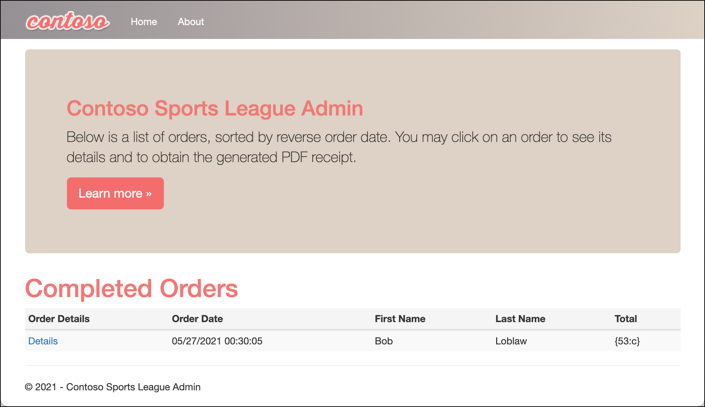

4. [Optional] You have validated the custom branding is displayed on the web app's logon page by closing any previously authenticated browser sessions to the Call Center Admin website and opening a new InPrivate or Incognito browser window and navigating to the **Call Center Admin** website. The browser will redirect to the branded access control logon URL.

    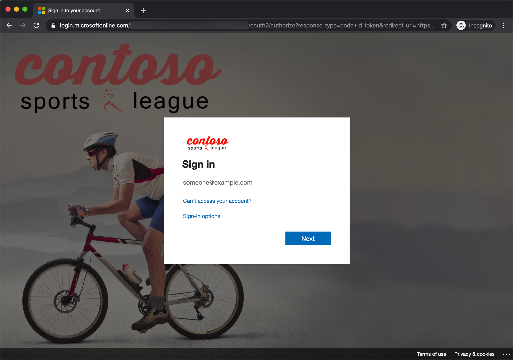

    >**Note**: If you run the app using localhost, ensure connection strings within all the appsettings.json files in the solution have the placeholders removed with actual values. Search on appsettings.json in the Visual Studio Solution Explorer to come up with the list.

## Challenge 9: Enable Azure AD B2C for the e-commerce website

Duration: 75 minutes

In this challenge, you configure an Azure AD Business-to-Consumer (B2C) instance to enable authentication and sign-in, sign-out and profile policies for the Contoso e-commerce website.

Note: This portion of the hands-on lab is written in a lab format due to the complexity of the configuration

### Challenge 9 tasks to complete

1. Create a Azure AD B2C tenant, with an organization name of `ContosoB2C` and a domain name of `contososportsorgXXXXX` where `XXXXX` is your alias, initials, or other unique identifier.
2. Create a new app registration in the newly created Azure AD B2C tenant with the following settings:
    - **Name**: `Contoso B2C Application`
    - **Supported account types**: Choose **Accounts in any identity provider or organizational directory (for authenticating users with user flows)**.
    - **Redirect URI**: Select Web and then enter the URL using the format, https://[your-web-app-name].azurewebsites.net/signin-oidc-b2c, replacing `[your-web-app-name] with the name of the App Service hosting the Contoso E-Commerce Site.
    - **Permissions**: Leave the **Grant admin consent to openid and offline_access permissions** checkbox checked.
3. For the newly created application:
   - Note the **Application (client) ID** of the newly created app registration for later reference.
   - Enable authentication via access tokens and ID tokens.
4. Create a sign-up (Email signup) user flow policy for your Azure AD B2C tenant.
    - This policy describes the experience consumers will have when signing up and the contents of tokens the application will receive on successful sign-ups.
    - **Note**: For the **MFA enforcement** of the sign-up policy, select **Conditional** to disable MFA for this challenge.
    - For user attributes and token claims, select the following:

        | Attribute name                 | Collect Attribute | Return claim |
        | ------------------------------ | ----------------- | ------------ |
        | City                           | Unchecked         | Unchecked    |
        | Country/Region                 | **Checked**       | Unchecked    |
        | Display Name                   | **Checked**       | **Checked**  |
        | Email Address                  | Unchecked         | Unchecked    |
        | Given Name                     | Unchecked         | Unchecked    |
        | Identify Provider              | Unchecked         | **Checked**  |
        | Identify Provider Access Token | Unchecked         | Unchecked    |
        | Job Title                      | Unchecked         | Unchecked    |
        | Legal Age Group Classification | Unchecked         | Unchecked    |
        | Postal Code                    | **Checked**       | **Checked**  |
        | State/Province                 | Unchecked         | Unchecked    |
        | Street Address                 | Unchecked         | Unchecked    |
        | Surname                        | Unchecked         | Unchecked    |
        | User is new                    | Unchecked         | **Checked**  |
        | User's Object ID               | Unchecked         | **Checked**  |

5. Create a profile editing (Email signin) user flow policy for your Azure AD B2C tenant.
   - **Note**: For the **MFA enforcement** of the sign-up policy, select **Conditional** to disable MFA for this challenge.
   - For user attributes and token claims, select the following:

        | Attribute name                 | Collect Attribute | Return claim |
        | ------------------------------ | ----------------- | ------------ |
        | City                           | Unchecked         | Unchecked    |
        | Country/Region                 | **Checked**       | Unchecked    |
        | Display Name                   | **Checked**       | **Checked**  |
        | Email Address                  | Unchecked         | Unchecked    |
        | Given Name                     | Unchecked         | Unchecked    |
        | Identify Provider              | Unchecked         | Unchecked    |
        | Identify Provider Access Token | Unchecked         | Unchecked    |
        | Job Title                      | **Checked**       | Unchecked    |
        | Legal Age Group Classification | Unchecked         | Unchecked    |
        | Postal Code                    | **Checked**       | **Checked**  |
        | State/Province                 | **Checked**       | Unchecked    |
        | Street Address                 | **Checked**       | Unchecked    |
        | Surname                        | Unchecked         | Unchecked    |
        | User's Object ID               | Unchecked         | Unchecked    |

6. Create a password reset (Reset password using email address) user flow policy.
   - **Note**: For the **MFA enforcement** of the sign-up policy, select **Conditional** to disable MFA for this challenge.
     - For user attributes and token claims, select the following:

        | Attribute name                 | Return claim |
        | ------------------------------ | ------------ |
        | City                           | Unchecked    |
        | Country/Region                 | Unchecked    |
        | Display Name                   | Unchecked    |
        | Email Address                  | **Checked**  |
        | Given Name                     | **Checked**  |
        | Job Title                      | Unchecked    |
        | Legal Age Group Classification | Unchecked    |
        | Postal Code                    | Unchecked    |
        | State/Province                 | Unchecked    |
        | Street Address                 | Unchecked    |
        | Surname                        | Unchecked    |
        | User's Object ID               | Unchecked    |

7. In Visual Studio on the `LabVM` virtual machine, modify the `Contoso.App.SportsLeague.Web` to use the Azure AD B2C tenant for authentication.
    - In Visual Studio, locate the `Startup.cs` file within the `Contoso.App.SportsLeague.Web` project and add the following `using` directives to the top of the file:

        ```csharp
        using Microsoft.AspNetCore.Authentication;
        using Microsoft.AspNetCore.Authentication.AzureADB2C.UI;
        ```

    - Locate the `ConfigureServices` method and all the following line of code to the bottom of this method:

        ```csharp
        services.AddAuthentication(Microsoft.AspNetCore.Authentication.AzureADB2C.UI.AzureADB2CDefaults.AuthenticationScheme)
            .AddAzureADB2C(options => Configuration.Bind("AzureADB2C", options));
        ```

    - In the `Configure` method, locate the `app.UserAuthorization();` line and add the following line of code before it:

        ```csharp
        app.UseAuthentication();
        ```

8. Send authentication requests to Azure AD to configure the app to communicate with Azure AD B2C by using ASP.NET Core Identity.
    - Add a new empty MVC Controller named `AccountController` to the **Controllers** folder of the `Contoso.App.SportsLeague.Web` project.
    - Add the following using statements to the top of the controller, below the existing using statements:

        ```csharp
        using Microsoft.AspNetCore.Authentication;
        using Microsoft.AspNetCore.Authentication.AzureADB2C.UI;
        using Microsoft.Extensions.Configuration;
        ```

    - Locate the default controller **Index** method and replace the entire method with the following code:

        ```csharp
        private string _editProfilePolicyId;

        public AccountController(IConfiguration configuration)
        {
            _editProfilePolicyId = configuration.GetValue<string>("AzureADB2C:EditProfilePolicyId");
        }

        public ActionResult SignIn()
        {
            if (!User.Identity.IsAuthenticated)
            {
                return Challenge(new AuthenticationProperties() { RedirectUri = "/" }, AzureADB2CDefaults.AuthenticationScheme);
            }
            return RedirectToAction("Index", "Home");
        }

        public ActionResult SignUp()
        {
            if (!User.Identity.IsAuthenticated)
            {
                return Challenge(new AuthenticationProperties() { RedirectUri = "/" }, AzureADB2CDefaults.AuthenticationScheme);
            }
            return RedirectToAction("Index", "Home");
        }

        public ActionResult Profile()
        {
            if (User.Identity.IsAuthenticated)
            {
                    var properties = new AuthenticationProperties() { RedirectUri = "/" };
                    properties.Items[AzureADB2CDefaults.PolicyKey] = _editProfilePolicyId;
                    return Challenge(
                        properties,
                        AzureADB2CDefaults.AuthenticationScheme);
            }
            return RedirectToAction("Index", "Home");
        }

        public ActionResult SignOut()
        {
            if (!User.Identity.IsAuthenticated)
            {
                return RedirectToAction("Index", "Home");
            }
            string redirectUri = Url.Action("Index", "Home", null, Request.Scheme);
            var properties = new AuthenticationProperties
            {
                RedirectUri = redirectUri
            };
            return SignOut(properties, AzureADB2CDefaults.CookieScheme, AzureADB2CDefaults.OpenIdScheme);
        }
        ```

9. Use the authentication claim to display user information in the e-commerce website's UI.
    - When you authenticate users by using OpenID Connect, Azure AD returns an ID token to the app that contains **claims**. These are assertions about the user. You can use claims to personalize your app. You can access user claims in your controllers via the ClaimsPrincipal.Current security principal object.
    - Open the `Controllers\`HomeController.cs` file in the `Contoso.App.SportsLeague.Web` project and add the following using statements to the file, below the existing using statements:

        ```csharp
        using Microsoft.AspNetCore.Authorization;
        ```

    - Next, add the following method to the `HomeController` class:

        ```csharp
        [Authorize]
        public ActionResult Claims()
        {
            var displayName = User.Identity.Name;
            ViewBag.DisplayName = displayName;
            ViewBag.Claims = User.Claims;
            return View();
        }
        ```

    - To access the claims that your application receives, you will create a new claims view that will display a list of all the claims the app receives. In the Visual Studio Solution Explorer, expand the `Views\Home` folder in the `Contoso.Apps.SportsLeague.Web` project, right-click the `Home` folder, and add a new empty Razor View named **Claims.cshtml**.
    - In the new **Claims.cshtml** file that opens in Visual Studio, replace all the file's contents with the following code:

        ```csharp
        @using System.Security.Claims
        @{
            ViewBag.Title = "Claims";
        }
        <h2>@ViewBag.Title</h2>

        <h4>Claims Present in the Claims Identity: @ViewBag.DisplayName</h4>

        <table class="table-hover claim-table">
            <tr>
                <th class="claim-type claim-data claim-head">Claim Type</th>
                <th class="claim-data claim-head">Claim Value</th>
            </tr>

            @foreach (Claim claim in ViewBag.Claims)
            {
                <tr>
                    <td class="claim-type claim-data">@claim.Type</td>
                    <td class="claim-data">@claim.Value</td>
                </tr>
            }
        </table>
        ```

10. Next, you will create a partial view to handle logging users in and out under the `Views\Shared` folder. Add another empty Razor View and name it `_LoginPartial.cshtml`, making sure to include the leading underscore, "_", in the file name).
    - Replace all contents of the file with the following code to create a razor partial view to provide a sign-in and sign-out link as well as a link to edit the user's profile:

        ```html
        @if (User.Identity.IsAuthenticated)
        {
            <text>
                <ul class="nav navbar-nav navbar-right">
                    <li>
                        <a id="profile-link">@User.Identity.Name</a>
                        <div id="profile-options" class="nav navbar-nav navbar-right">
                            <ul class="profile-links">
                                <li class="profile-link">
                                    @Html.ActionLink("Edit Profile", "Profile", "Account")
                                </li>
                            </ul>
                        </div>
                    </li>
                    <li>
                        @Html.ActionLink("Sign out", "SignOut", "Account")
                    </li>
                </ul>
            </text>
        }
        else
        {
            <ul class="nav navbar-nav navbar-right">
                <li>@Html.ActionLink("Sign up", "SignUp", "Account", routeValues: null, htmlAttributes: new { id = "signUpLink" })</li>
                <li>@Html.ActionLink("Sign in", "SignIn", "Account", routeValues: null, htmlAttributes: new { id = "loginLink" })</li>
            </ul>
        }
        ```

11. Integrate the new login view by opening `Views\Shared\_Layout.cshtml` in Visual Studio and locate the `DIV` markdown element that has the class of `header-top` (line 46 of the file), and add the line that starts with `@Html.ActionLink` and the line that starts with `@Html.Partial`.

    ```html
    <div class="header-top">
        <div class="container">
            <div class="row">
                <div class="header-top-left">
                <a href="#"><i class="fa fa-twitter"></i></a>
                <a href="#"><i class="fa fa-facebook"></i></a>
                <a href="#"><i class="fa fa-linkedin"></i></a>
                <a href="#"><i class="fa fa-instagram"></i></a>
                </div>
                <div class="header-top-right">
                    <a href="#" class="top-wrap"><span class="icon-phone">Call today: </span> (555) 555-8000</a>
                    @Html.ActionLink("Claims", "Claims", "Home")
                </div>
                @Html.Partial("_LoginPartial")
            </div>
        </div>
    </div>
    ```

12. Update Web App configuration settings for the e-commerce web app in the Azure portal.

    > **Note**: You will need the name of your Azure AD B2C tenant, which you can retrieve by locating the Azure AD B2C resource in your resource group and coping the name portion of the **B2C tenant**. The name portion of the tenant is everything leading up to the first period (.) in the resource name. So, you will exclude `.onmicrosoft.com`.

    - Add the following settings in the **Application Settings** section of the e-commerce site:
      - AzureADB2C:Instance - `https://[your-AAD-B2C-tenant-name].b2clogin.com/tfp/`
      - AzureADB2C:ClientId - **B2C Application ID you copied down earlier**.
      - AzureADB2C:CallbackPath - `/signin-oidc-b2c`
      - AzureADB2C:Domain - `[your-AAD-B2C-tenant-name]`.onmicrosoft.com**
      - AzureADB2C:SignUpSignInPolicyId - `B2C_1_SignUp`
      - AzureADB2C:ResetPasswordPolicyId - `B2C_1_PasswordReset`
      - AzureADB2C:EditProfilePolicyId - `B2C_1_EditProfile`

13. Redeploy the `Contoso.Apps.SportsLeague.Web` from Visual Studio and run the e-commerce website to test application authentication using Azure AD B2C.

### Challenge 9 success criteria

- You have verified the `/Claims`, `Sign up`, and `Sign in` links appear on the home page of the e-commerce website.

    

- You have tested the Sign up, sign out functionality.
  - When you are signed in and select `/Claims`, you will see something similar to the following:

    

    - When you select Claims and are not signed in, it will redirect you to the sign-in page.

- You have tested the Edit Profile functionality.

## Challenge 10: Enable Telemetry with Application Insights

**Duration**: 30 Minutes

To configure the application for logging and diagnostics, you have been asked to configure Microsoft Azure Application Insights and add some custom telemetry.

### Challenge 10 tasks to complete

1. Configure server-side telemetry collection for the e-commerce website.
    - In Visual Studio on the `LabVM` virtual machine, add the latest version of the `Microsoft.ApplicationInsights.AspNetCore` NuGet package to the `Contoso.Apps.SportsLeague.Web` project.
    - Open the `\Helpers\TelemetryHelper.cs` file in the project and add the following using statements to the top of the file:

        ```csharp
        using Microsoft.ApplicationInsights;
        using Microsoft.ApplicationInsights.Extensibility;
        ```

    - Add the following code to the `TrackException` method to instantiate the telemetry client and track exceptions:

        ```csharp
        var client = new TelemetryClient(TelemetryConfiguration.CreateDefault());
        client.TrackException(new Microsoft.ApplicationInsights.DataContracts.ExceptionTelemetry(exc));
        ```

    - Add the following code to the **TrackEvent** method to instantiate the telemetry client and track event data:

        ```csharp
        var client = new TelemetryClient(TelemetryConfiguration.CreateDefault());
        client.TrackEvent(eventName, properties);
        ```

2. Enable client side telemetry collection for the e-commerce website.
    - Retrieve the **Instrumentation Key** for your **Application Insights** resource in Azure.
    - Use the **Getting Started** section of your Application Insights resource to follow the **Snippet based setup** instructions under **Adding the JavaScript SDK**.
    - Select and copy the full contents of the JavaScript under the **Snippet based setup** heading. Here is the JavaScript code to copy for quick reference:

        ```javascript
        <script type="text/javascript">
        !function(T,l,y){var S=T.location,k="script",D="instrumentationKey",C="ingestionendpoint",I="disableExceptionTracking",E="ai.device.",b="toLowerCase",w="crossOrigin",N="POST",e="appInsightsSDK",t=y.name||"appInsights";(y.name||T[e])&&(T[e]=t);var n=T[t]||function(d){var g=!1,f=!1,m={initialize:!0,queue:[],sv:"5",version:2,config:d};function v(e,t){var n={},a="Browser";return n[E+"id"]=a[b](),n[E+"type"]=a,n["ai.operation.name"]=S&&S.pathname||"_unknown_",n["ai.internal.sdkVersion"]="javascript:snippet_"+(m.sv||m.version),{time:function(){var e=new Date;function t(e){var t=""+e;return 1===t.length&&(t="0"+t),t}return e.getUTCFullYear()+"-"+t(1+e.getUTCMonth())+"-"+t(e.getUTCDate())+"T"+t(e.getUTCHours())+":"+t(e.getUTCMinutes())+":"+t(e.getUTCSeconds())+"."+((e.getUTCMilliseconds()/1e3).toFixed(3)+"").slice(2,5)+"Z"}(),iKey:e,name:"Microsoft.ApplicationInsights."+e.replace(/-/g,"")+"."+t,sampleRate:100,tags:n,data:{baseData:{ver:2}}}}var h=d.url||y.src;if(h){function a(e){var t,n,a,i,r,o,s,c,u,p,l;g=!0,m.queue=[],f||(f=!0,t=h,s=function(){var e={},t=d.connectionString;if(t)for(var n=t.split(";"),a=0;a<n.length;a++){var i=n[a].split("=");2===i.length&&(e[i[0][b]()]=i[1])}if(!e[C]){var r=e.endpointsuffix,o=r?e.location:null;e[C]="https://"+(o?o+".":"")+"dc."+(r||"services.visualstudio.com")}return e}(),c=s[D]||d[D]||"",u=s[C],p=u?u+"/v2/track":d.endpointUrl,(l=[]).push((n="SDK LOAD Failure: Failed to load Application Insights SDK script (See stack for details)",a=t,i=p,(o=(r=v(c,"Exception")).data).baseType="ExceptionData",o.baseData.exceptions=[{typeName:"SDKLoadFailed",message:n.replace(/\./g,"-"),hasFullStack:!1,stack:n+"\nSnippet failed to load ["+a+"] -- Telemetry is disabled\nHelp Link: https://go.microsoft.com/fwlink/?linkid=2128109\nHost: "+(S&&S.pathname||"_unknown_")+"\nEndpoint: "+i,parsedStack:[]}],r)),l.push(function(e,t,n,a){var i=v(c,"Message"),r=i.data;r.baseType="MessageData";var o=r.baseData;return o.message='AI (Internal): 99 message:"'+("SDK LOAD Failure: Failed to load Application Insights SDK script (See stack for details) ("+n+")").replace(/\"/g,"")+'"',o.properties={endpoint:a},i}(0,0,t,p)),function(e,t){if(JSON){var n=T.fetch;if(n&&!y.useXhr)n(t,{method:N,body:JSON.stringify(e),mode:"cors"});else if(XMLHttpRequest){var a=new XMLHttpRequest;a.open(N,t),a.setRequestHeader("Content-type","application/json"),a.send(JSON.stringify(e))}}}(l,p))}function i(e,t){f||setTimeout(function(){!t&&m.core||a()},500)}var e=function(){var n=l.createElement(k);n.src=h;var e=y[w];return!e&&""!==e||"undefined"==n[w]||(n[w]=e),n.onload=i,n.onerror=a,n.onreadystatechange=function(e,t){"loaded"!==n.readyState&&"complete"!==n.readyState||i(0,t)},n}();y.ld<0?l.getElementsByTagName("head")[0].appendChild(e):setTimeout(function(){l.getElementsByTagName(k)[0].parentNode.appendChild(e)},y.ld||0)}try{m.cookie=l.cookie}catch(p){}function t(e){for(;e.length;)!function(t){m[t]=function(){var e=arguments;g||m.queue.push(function(){m[t].apply(m,e)})}}(e.pop())}var n="track",r="TrackPage",o="TrackEvent";t([n+"Event",n+"PageView",n+"Exception",n+"Trace",n+"DependencyData",n+"Metric",n+"PageViewPerformance","start"+r,"stop"+r,"start"+o,"stop"+o,"addTelemetryInitializer","setAuthenticatedUserContext","clearAuthenticatedUserContext","flush"]),m.SeverityLevel={Verbose:0,Information:1,Warning:2,Error:3,Critical:4};var s=(d.extensionConfig||{}).ApplicationInsightsAnalytics||{};if(!0!==d[I]&&!0!==s[I]){var c="onerror";t(["_"+c]);var u=T[c];T[c]=function(e,t,n,a,i){var r=u&&u(e,t,n,a,i);return!0!==r&&m["_"+c]({message:e,url:t,lineNumber:n,columnNumber:a,error:i}),r},d.autoExceptionInstrumented=!0}return m}(y.cfg);function a(){y.onInit&&y.onInit(n)}(T[t]=n).queue&&0===n.queue.length?(n.queue.push(a),n.trackPageView({})):a()}(window,document,{
        src: "https://js.monitor.azure.com/scripts/b/ai.2.min.js", // The SDK URL Source
        // name: "appInsights", // Global SDK Instance name defaults to "appInsights" when not supplied
        // ld: 0, // Defines the load delay (in ms) before attempting to load the sdk. -1 = block page load and add to head. (default) = 0ms load after timeout,
        // useXhr: 1, // Use XHR instead of fetch to report failures (if available),
        crossOrigin: "anonymous", // When supplied this will add the provided value as the cross origin attribute on the script tag
        // onInit: null, // Once the application insights instance has loaded and initialized this callback function will be called with 1 argument -- the sdk instance (DO NOT ADD anything to the sdk.queue -- As they won't get called)
        cfg: { // Application Insights Configuration
            instrumentationKey: "YOUR_INSTRUMENTATION_KEY_GOES_HERE"
            /* ...Other Configuration Options... */
        }});
        </script>
        ```

        > **Important**: Make sure to replace the `YOUR_INSTRUMENTATION_KEY_GOES_HERE` placeholder with the Application Insights Instrumentation Key.

    - In the `Views\Shared\_Layout.cshtml` file of the `Contoso.Apps.SportsLeague.Web` project in Visual Studio, paste in the code you copied immediately before the `</head>` tag. Don't forget to insert your **Instrumentation Key** into the JavaScript code `instrumentationKey:` value.

3. Republish the e-commerce Web App from Visual Studio.

### Challenge 10 success criteria

- You have selected a few links on the e-commerce website and submitted several new orders to generate some sample telemetry.
- You have explored the telemetry data created in Application Insights on the **Application Dashboard**.
  - View the performance timeline to see the overall number of requests and page load time.
- Navigate back to the Application Insights overview for the **Application Insights** instance, then select **Performance** in the left-hand navigation menu to see individual endpoint render performance.
- Under the **Usage** link area, select the **Events** menu option. Select the **View More Insights** button and select **View More Insights**, then scroll down to see event list.

## Challenge 11: Automating backend processes with Azure Functions and Logic Apps

**Duration**: 45 Minutes

Contoso wants to automate the process of generating receipts in PDF format and alerting users when their orders have been processed using Azure Logic App and Functions. To run custom snippets of `C#` or node.js in Logic Apps, you can create custom functions through Azure Functions.

[Azure Functions](https://docs.microsoft.com/azure/azure-functions/functions-overview) offer serverless computing in Microsoft Azure and are useful for performing these tasks:

- Advanced formatting or compute of fields in logic apps
- Perform calculations in a workflow
- Extend the logic app functionality with functions that are supported in `C#` or node.js

[Azure Logic Apps](https://docs.microsoft.com/azure/logic-apps/logic-apps-overview) workflows enable creating automated business processes more easily and quickly, without needing to write any code. Logic Apps provide a way to simplify and implement scalable integrations and workflows in the cloud. The advantages of using Logic Apps include the following:

- Saving time by designing complex processes using easy to understand design tools
- Implementing patterns and workflows seamlessly, that would otherwise be difficult to implement in code
- Getting started quickly from templates
- Customizing your logic app with your own custom APIs, code, and actions
- Connect and synchronize disparate systems across on-premises and the cloud
- Build off BizTalk server, API Management, Azure Functions, and Azure Service Bus with first-class integration support

### Challenge 11 tasks to complete

1. Create an Azure Function App to generate PDF receipts.
2. Update the new Function App's configuration to use the App Configuration resource for application settings, naming the new connection string setting `AppConfigConnectionString`.

    > **Hint**: You can use the e-commerce Web App configuration as an example of how this should be configured.

3. Create an Access Policy in Key Vault for new Web App's Managed Service Identity to allow it to read secrets.
4. Configure and deploy the Function App from Visual Studio on the `LabVM` virtual machine.
    - Add the latest versions of the `Microsoft.Extensions.Configuration.AzureAppConfiguration` and `Azure.Identity` NuGet packaged to the `Contoso.Apps.FunctionApp` project in Visual Studio.
    - In the project, open the `ContosoMakePdf.cs` file and within it:
      - Uncomment the following **using** statements:

        ```csharp
        using Microsoft.Extensions.Configuration;
        using Azure.Identity;
        ```  

    - Inside the static class `ContosoMakePdf`, uncomment the following code that sets up a connection to the App Configuration store and the Key Vault credential pass-through:

        ```csharp
        private static IConfiguration Configuration { set; get; }

        static ContosoMakePdf()
        {
            var builder = new ConfigurationBuilder();            
            builder.AddAzureAppConfiguration(options =>
            {
                options.Connect(Environment.GetEnvironmentVariable("AppConfigConnectionString"))               
                        .ConfigureKeyVault(kv =>
                        {
                            kv.SetCredential(new DefaultAzureCredential());
                        });
            });
            Configuration = builder.Build();
        }
        ```

    - In the `ProcessOrder` method, uncomment the following line of code:

        ```csharp
        Order.ReceiptUrl = await StorageMethods.UploadPdfToBlob(receipt, fileName, Configuration, log);
        ```

5. Publish the function code to your Azure Function App in Visual Studio.
6. Open the Logic App resource in your Azure resource group and launch the **Logic Apps Designer**.
7. Create a new workflow using the **When a message is received in a Service Bus queue** template provided.
    - Create a connection to the Service Bus instance in your resource group.
    - Configured the workflow trigger to fire when a message is received in the `receiptgenerator` queue, checking for new messages every 30 seconds.
    - Add a step to call your Azure Function that generated PDF receipts. Type this into the request body field, replacing `[SELECT Content from the Dynamic content list]` with the dynamic content value named `Content`:

        ```json
        {"Order": [SELECT Content from the Dynamic content list] }
        ```

        > **Note**: Selecting Save on the workflow and running it should generate PDF receipts for the test orders you have created throughout this challenge.

    - Add a new step to update rows in the `Orders` table in your `ContosoSportsDB` SQL Database. Use the `OrderId` as the `Row id` in the Logic App action. Select **Save**, then select the **Code View** button and add the following JSON within the `Update_row_(V2).inputs` object:

        ```json
        "body": {
            "OrderDate": "@{body('ContosoMakePDF')['OrderDate']}",
            "FirstName": "@{body('ContosoMakePDF')['FirstName']}",
            "LastName": "@{body('ContosoMakePDF')['LastName']}",
            "Address": "@{body('ContosoMakePDF')['Address']}",
            "City": "@{body('ContosoMakePDF')['City']}",
            "State": "@{body('ContosoMakePDF')['State']}",
            "PostalCode": "@{body('ContosoMakePDF')['PostalCode']}",
            "Country": "@{body('ContosoMakePDF')['Country']}",
            "Phone": "@{body('ContosoMakePDF')['Phone']}",
            "SMSOptIn": "@{body('ContosoMakePDF')['SMSOptIn']}",
            "SMSStatus": "@{body('ContosoMakePDF')['SMSStatus']}",
            "Email": "@{body('ContosoMakePDF')['Email']}",
            "ReceiptUrl": "@{body('ContosoMakePDF')['ReceiptUrl']}",
            "Total": "@{body('ContosoMakePDF')['Total']}",
            "PaymentTransactionId": "@{body('ContosoMakePDF')['PaymentTransactionId']}",
            "HasBeenShipped": "@{body('ContosoMakePDF')['HasBeenShipped']}"
        },
        ```

    - While still in the code view, modify the `path` variable for the `Update_row_(V2)` action to include the index key or OrderId as follows, and then save the workflow and return to the design view.

        ```json
        "path": "/v2/datasets/@{encodeURIComponent(encodeURIComponent('default'))},@{encodeURIComponent(encodeURIComponent('default'))}/tables/@{encodeURIComponent(encodeURIComponent('[dbo].[Orders]'))}/items/@{encodeURIComponent(encodeURIComponent(body('ContosoMakePDF')['OrderId']))}"
        ```

    - Save and run the Logic App workflow.

### Challenge 11 success criteria

- You have tested for your function app by opening the `sample.dat` file found in the `C:\MCW\MCW-Modern-cloud-apps-main\Hands-on lab\lab-files\src\Contoso Sports League\Contoso.CreatePDFReport` directory on your LabVM and sending a POST request to the function that contains the contents of that file in the request body.
- Your function generates a PDF file in the storage account for the Contoso Sports solution.
- Orders should only be processed once.
- Receipts should be downloadable from the admin website. Open the Call Center Admin website and select the last Details link in the list. You should now see a **Download receipt link** because the database has been updated. Select the Download receipt link to see the receipt.

    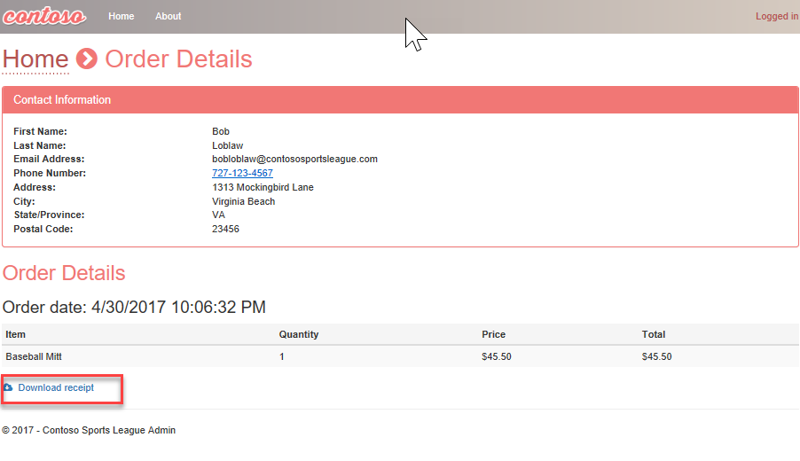

- Verify that in your Logic app you see all green check marks for each step. If not, select the yellow status icon to find out details.

## Challenge 12: Use Twilio to send SMS Order Notifications

**Duration**: 45 Minutes

### Challenge 12 tasks to complete

1. Configure a Twilio trial account. If you do not have a Twilio account, sign up for one for free at [https://www.twilio.com/try-twilio](https://www.twilio.com/try-twilio)
2. In your Twilio account, create a trial number and then copy the **Account SID** and **Auth Token** for use when configuring the Twilio Connector in Logic Apps.
3. Using Azure Data Studio installed on the `LabVm` virtual machine, connect to the `ContosoSportsDB` SQL Database and create two new stored procedures using the following code:

    ```sql
    CREATE PROCEDURE [dbo].[GetUnprocessedOrders]
    AS
    declare @returnCode int 
    SELECT @returnCode = COUNT(*) FROM [dbo].[Orders] WHERE PaymentTransactionId is not null AND PaymentTransactionId <> '' AND Phone is not null AND Phone <> '' AND SMSOptIn = '1' AND SMSStatus is null
    return @returnCode

    GO
    ```

    ```sql
    CREATE PROCEDURE [dbo].[ProcessOrders]
    AS
    SELECT * FROM [dbo].[Orders] WHERE PaymentTransactionId is not null AND PaymentTransactionId <> '' AND Phone is not null AND Phone <> '' AND SMSOptIn = '1' AND SMSStatus is null;

    UPDATE [dbo].[Orders] SET SMSStatus = 'sent' WHERE PaymentTransactionId is not null AND PaymentTransactionId <> '' AND Phone is not null AND Phone <> '' AND SMSOptIn = '1' AND SMSStatus is null;
    ```

4. Create a new consumption tier Logic App in your Azure resource group and then create a new Blank Logic App, which uses a timer trigger that will fire on a frequency of once every minute.
5. Add a new step using the **SQL Server -- Execute stored procedure (V2)** action. In the **Execute stored procedure (V2)** box, we'll be reusing the established connection to the failover Read/write listener endpoint of our ContosoSportsDB:
    - **Server name**: Select **Use connection settings**
    - **Database name**: Select **Use connection settings**
    - **Procedure name**: Select `[dbo].[GetUnprocessedOrders]`.
6. Select **+ New step** and search for and select the **Control** object and under **Actions**.
    - Select the **Condition** object. Select **Choose a value**, and then select **Return Code** from the Dynamic content tile.
    - Specify **ReturnCode**, set the RELATIONSHIP to **is greater than**, and set the VALUE to **0**.
7. Select the **Add an action** link on the **If true** condition.
    - Select **SQL Server**, and then select the **SQL Server -- Execute stored procedure (V2)** action.
    - Select the **ProcessOrders** stored procedure in the Procedure name dropdown.
8. Select the **Add an action** link. Select **Control** and **For each**.
    - In the **Select an output from previous steps**, select **ResultSets Table1**.
9. Select **Add an action** within the **For each** block, and search for **Twilio** in the filter box, and select the **Twilio -- Send Text Message (SMS)** item in the Actions box.
    - Set the Connection Name to Twilio, specify your Twilio **Account SID** and **Authentication Token**, then select the **Create** button.
    - Using the drop-down, select your Twilio number for the **FROM PHONE NUMBER** field.
    - In the **To phone number** field, select **ResultSets Phone**.
    - In the **Text** field, enter `Hello` followed by the dynamic value for **ResultSets FirstName**, then followed by `, your order has shipped!`.
10. On the Logic App toolbar, select the **Code View** button to review the JSON code generated by the UI.
11. **Save** the logic app. The completed JSON code should look similar to the following:

    ```json
    {
        "definition": {
            "$schema": "https://schema.management.azure.com/providers/Microsoft.Logic/schemas/2016-06-01/workflowdefinition.json#",
            "actions": {
                "Condition": {
                    "actions": {
                        "Execute_stored_procedure_(V2)_2": {
                            "inputs": {
                                "body": {},
                                "host": {
                                    "connection": {
                                        "name": "@parameters('$connections')['sql']['connectionId']"
                                    }
                                },
                                "method": "post",
                                "path": "/v2/datasets/@{encodeURIComponent(encodeURIComponent('default'))},@{encodeURIComponent(encodeURIComponent('default'))}/procedures/@{encodeURIComponent(encodeURIComponent('[dbo].[ProcessOrders]'))}"
                            },
                            "runAfter": {},
                            "type": "ApiConnection"
                        },
                        "For_each": {
                            "actions": {
                                "Send_Text_Message_(SMS)": {
                                    "inputs": {
                                        "body": {
                                            "body": "Hello @{items('For_each')?['FirstName']}, your order has shipped.",
                                            "from": "+15708869103",
                                            "to": "@items('For_each')?['Phone']"
                                        },
                                        "host": {
                                            "connection": {
                                                "name": "@parameters('$connections')['twilio']['connectionId']"
                                            }
                                        },
                                        "method": "post",
                                        "path": "/Messages.json"
                                    },
                                    "runAfter": {},
                                    "type": "ApiConnection"
                                }
                            },
                            "foreach": "@body('Execute_stored_procedure_(V2)_2')?['resultsets']?['Table1']",
                            "runAfter": {
                                "Execute_stored_procedure_(V2)_2": [
                                    "Succeeded"
                                ]
                            },
                            "type": "Foreach"
                        }
                    },
                    "expression": {
                        "and": [
                            {
                                "greater": [
                                    "@body('Execute_stored_procedure_(V2)')?['returncode']",
                                    0
                                ]
                            }
                        ]
                    },
                    "runAfter": {
                        "Execute_stored_procedure_(V2)": [
                            "Succeeded"
                        ]
                    },
                    "type": "If"
                },
                "Execute_stored_procedure_(V2)": {
                    "inputs": {
                        "body": {},
                        "host": {
                            "connection": {
                                "name": "@parameters('$connections')['sql']['connectionId']"
                            }
                        },
                        "method": "post",
                        "path": "/v2/datasets/@{encodeURIComponent(encodeURIComponent('default'))},@{encodeURIComponent(encodeURIComponent('default'))}/procedures/@{encodeURIComponent(encodeURIComponent('[dbo].[GetUnprocessedOrders]'))}"
                    },
                    "runAfter": {},
                    "type": "ApiConnection"
                }
            },
            "contentVersion": "1.0.0.0",
            "outputs": {},
            "parameters": {
                "$connections": {
                    "defaultValue": {},
                    "type": "Object"
                }
            },
            "triggers": {
                "Recurrence": {
                    "recurrence": {
                        "frequency": "Minute",
                        "interval": 1
                    },
                    "type": "recurrence"
                }
            }
        },
        "parameters": {
            "$connections": {
                "value": {
                    "sql": {
                        "connectionId": "/subscriptions/e223f1b3-d19b-4cfa-98e9-bc9be62717bc/resourceGroups/hands-on-lab/providers/Microsoft.Web/connections/sql",
                        "connectionName": "sql",
                        "id": "/subscriptions/e223f1b3-d19b-4cfa-98e9-bc9be62717bc/providers/Microsoft.Web/locations/eastus/managedApis/sql"
                    },
                    "twilio": {
                        "connectionId": "/subscriptions/e223f1b3-d19b-4cfa-98e9-bc9be62717bc/resourceGroups/hands-on-lab/providers/Microsoft.Web/connections/twilio",
                        "connectionName": "twilio",
                        "id": "/subscriptions/e223f1b3-d19b-4cfa-98e9-bc9be62717bc/providers/Microsoft.Web/locations/eastus/managedApis/twilio"
                    }
                }
            }
        }
    }
    ```

### Exercise 12 success criteria

- Your workflow should look like the image below, and you should receive a text for each order you placed. If you did not use your own phone number, place another order, and enter a phone number for which you can receive text messages.

    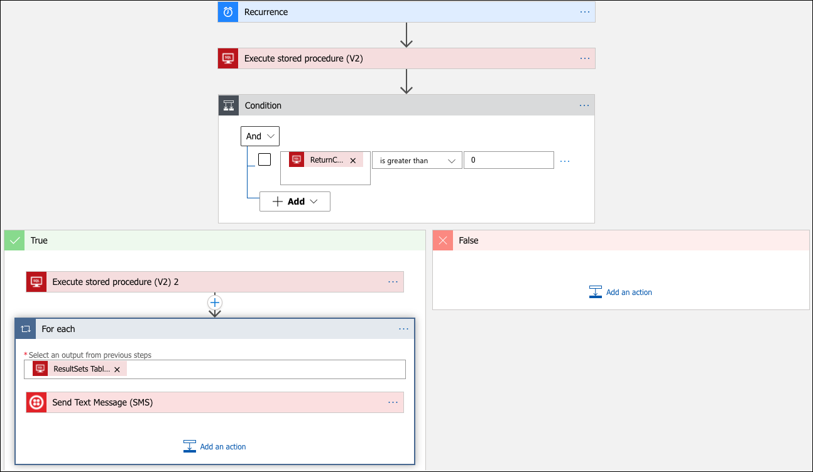

## Exercise 13: Automate deployments using GitHub actions

**Duration**: 30 minutes

The Contoso Sports League would like to move their existing source control to GitHub. In addition to this, they wish to implement automatic deployments of their projects into production. The desired workflow is that features are developed in their own branch and once complete, pull requests are issued to the main branch. The pull requests are then reviewed for quality assurance, and once approved, the pull request is then merged into the main branch of the repository. Upon this merge, the projects in the solution should be automatically released into the production Azure environment using the code from the main branch. In this exercise, you will learn how to deploy code to Azure from GitHub Actions in two different ways: via a Service Principal created in Active Directory, as well as via Application Service Publish Profiles.

In this exercise, you will release the Call Center Admin Portal application using this a service principal. This service principal is created in Azure Active Directory, and is granted the Contributor role to the deployed lab resources, scoped by the resource group.

### Exercise 13 tasks to complete

1. Create a [GitHub](https://www.github.com) repository named `ContosoSports`.
2. Commit the existing lab files to source control from your `LabVm` virtual machine.
    - Open a command prompt and change directory to the folder that contains the lab files solution file (Contoso.Apps.SportsLeague.sln), `C:\MCW\MCW-Modern-cloud-apps-main\Hands-on lab\lab-files\src\Contoso Sports League` and at the command prompt, issue the following command to initialize the git repository:

        ```shell
        git init
        ```

    - Set the remote origin to the GitHub Url from the previous task by executing the following command (replace the URL with your own):

        ```shell
        git remote add origin <your GitHub Url>
        ```

    - Commit the initial code, and push it to the main branch by issuing the following commands:

        ```shell
        git config --global user.email "<ENTER YOUR GITHUB EMAIL HERE>"
        git add -A
        git commit -m "initial commit"
        git branch -m main
        git push -u origin main
        ```

3. Create a service principal in Azure Active Directory using the Azure Cloud Shell.

    > One method to deploy code using GitHub actions is to create a Service Principal that has the necessary access to deploy the web applications in the solution.

4. In the Cloud Shell, execute the following command to create the service principal scoped by the resource group you have been using in this lab, **making sure to replace the Subscription ID and resource group name with your values**. Copy the JSON results of the command for use lated in this challenge.

    ```PowerShell
    az ad sp create-for-rbac --name 'mcw-modern-cloud-apps' --role contributor --scopes /subscriptions/<Subscription ID>/resourceGroups/<Resource Group Name> --sdk-auth
    ```

5. Create repository secrets in your GitHub repo.

    > You have the ability to add secrets to the repository in GitHub. Secrets contain sensitive information that should never be checked into source control. These secrets are kept encrypted by GitHub and are made available to GitHub actions through the **secrets** collection (which you will see in the next task). You will be creating many secrets, as you have five projects that you are configuring for auto-deployment.

    - Create the service principal credentials secret. In the New secret form, enter the name **AZURE_CREDENTIALS**, and for the value, paste in the JSON data obtained when creating the Service Principal in the previous task.
    - Create the e-commerce web application publish profile secret.
      - In the Azure Portal, open the e-commerce web application and from the top toolbar of the App Service screen, select **Get publish profile** item. This will download a file.
      - Open this file in a text editor.
      - Return to the ContosoSports repository GitHub Secrets screen, and add a new secret named **AZURE_WEBAPP_PUBLISH_PROFILE**, for the value, paste the contents of the publish profile from the previous step, then select the **Add secret** button.
    - Create publish profile secrets for the remaining projects.
      - Repeat Subtask 2 for the remaining projects by obtaining the publish profiles from the Azure Portal. Create the secrets as follows:

        | Secret Name | Value |
        | ----------- | ----- |
        | AZURE_API_PAYMENT_PUBLISH_PROFILE | Contents of the publish profile for the Payments API |
        | AZURE_API_OFFERS_PUBLISH_PROFILE | Contents of the publish profile for the Offers API |
        | AZURE_FUNCTIONAPP_PUBLISH_PROFILE | Contents of the publish profile for the Receipt Function Application |

6. Define the production deployment workflow.
   - In your GitHub repository, and select the **Actions** tab and beneath the **Get started with GitHub Actions** heading, select the **set up a workflow yourself** link.
   - Above the editor, name the workflow **productiondeployment.yml**. Remove all code in the file editor.
   - Copy and paste the following workflow to the text editor. The code is documented inline.

        ```yml
        name: Contoso Sports Production Deployment

        # This workflow is triggered on push to the main branch of the repository
        on:
        push:
            branches:
            - main

        # Environment variables are defined so that they can be used throughout the job definitions.
        # Be sure to replace the tokens in the AZURE_*_NAME variables with the names of the resources in Azure
        env:  
        AZURE_WEBAPP_NAME: '<E-Commerce Web Application Name - named similar to contosoapp{random characters}>'
        AZURE_WEBAPP_PROJECT_NAME: 'Contoso.Apps.SportsLeague.Web'  
        AZURE_WEBAPP_PUBLISH_PROFILE: ${{ secrets.AZURE_WEBAPP_PUBLISH_PROFILE }}

        AZURE_ADMINAPP_NAME: '<The name of the Call Center admin App Service in Azure>'
        AZURE_ADMINAPP_PROJECT_NAME: 'Contoso.Apps.SportsLeague.Admin'

        AZURE_API_PAYMENT_NAME: '<The name of the Payments API App Service in Azure>'
        AZURE_API_PAYMENT_PROJECT_NAME: 'Contoso.Apps.PaymentGateway'
        AZURE_API_PAYMENT_PUBLISH_PROFILE: ${{ secrets.AZURE_API_PAYMENT_PUBLISH_PROFILE }}

        AZURE_API_OFFERS_NAME: '<The name of the Offers API App Service in Azure>'
        AZURE_API_OFFERS_PROJECT_NAME: 'Contoso.Apps.SportsLeague.Offers'
        AZURE_API_OFFERS_PUBLISH_PROFILE: ${{ secrets.AZURE_API_OFFERS_PUBLISH_PROFILE }}

        AZURE_FUNCTIONAPP_NAME: '<The name of the Function App in Azure>'
        AZURE_FUNCTIONAPP_PROJECT_NAME: 'Contoso.Apps.FunctionApp'
        AZURE_FUNCTIONAPP_PUBLISH_PROFILE: ${{ secrets.AZURE_FUNCTIONAPP_PUBLISH_PROFILE }}

        DOTNET_VERSION: '3.1.102'

        # Jobs define the actions that take place when code is pushed to the main branch
        jobs:

        # Build and deploy the E-Commerce Web Application using the Publish Profile
        build-and-deploy-webapp:
            runs-on: ubuntu-latest
            steps:
            # Checkout the repo
            - uses: actions/checkout@main

            # Setup .NET Core SDK
            - name: Setup .NET Core
                uses: actions/setup-dotnet@v1
                with:
                dotnet-version: ${{ env.DOTNET_VERSION }}

            # Run dotnet build and publish on the project
            - name: dotnet build web portal and publish
                run: |
                dotnet build ${{ env.AZURE_WEBAPP_PROJECT_NAME }} --configuration Release
                dotnet publish ${{ env.AZURE_WEBAPP_PROJECT_NAME }} -c Release -o './webdeploy'

            # Deploy to Azure Application Service
            - name: 'Deploy public web portal'
                uses: azure/webapps-deploy@v2
                with:
                app-name: ${{ env.AZURE_WEBAPP_NAME }}
                publish-profile: ${{ secrets.AZURE_WEBAPP_PUBLISH_PROFILE }}
                package: './webdeploy'

        # Build and deploy the Call Center admin using the Service Principal credentials
        build-and-deploy-admin:
            runs-on: ubuntu-latest
            steps:
            # Checkout the repo
            - uses: actions/checkout@main

            # Setup .NET Core SDK
            - name: Setup .NET Core
                uses: actions/setup-dotnet@v1
                with:
                dotnet-version: ${{ env.DOTNET_VERSION }}

            # Run dotnet build and publish
            - name: dotnet build web portal and publish on the project
                run: |
                dotnet build ${{ env.AZURE_ADMINAPP_PROJECT_NAME }} --configuration Release
                dotnet publish ${{ env.AZURE_ADMINAPP_PROJECT_NAME }} -c Release -o './admindeploy'

            # Login to Azure
            - name: Login via Az module
                uses: azure/login@v1.1
                with:
                creds: ${{ secrets.AZURE_CREDENTIALS }}

            # Deploy to Azure Application Service
            - name: 'Deploy admin web portal'
                uses: azure/webapps-deploy@v2
                with:
                app-name: ${{ env.AZURE_ADMINAPP_NAME }}
                credentials: ${{ secrets.AZURE_CREDENTIALS }}
                package: './admindeploy'

            ##Azure logout
            - name: logout
                run: |
                az logout

        # Build and deploy the Payments API using the Publish Profile
        build-and-deploy-payment-api:
            runs-on: ubuntu-latest
            steps:
            # Checkout the repo
            - uses: actions/checkout@main

            # Setup .NET Core SDK
            - name: Setup .NET Core
                uses: actions/setup-dotnet@v1
                with:
                dotnet-version: ${{ env.DOTNET_VERSION }}

            # Run dotnet build and publish on the project
            - name: dotnet build web portal and publish
                run: |
                dotnet build ${{ env.AZURE_API_PAYMENT_PROJECT_NAME }} --configuration Release
                dotnet publish ${{ env.AZURE_API_PAYMENT_PROJECT_NAME }} -c Release -o './paymentapideploy'

            # Deploy to Azure App Service 
            - name: 'Deploy payments API'
                uses: azure/webapps-deploy@v2
                with:
                app-name: ${{ env.AZURE_API_PAYMENT_NAME }}
                publish-profile: ${{ env.AZURE_API_PAYMENT_PUBLISH_PROFILE }}
                package: './paymentapideploy'

        # Build and deploy the Offer API using the Publish Profile
        build-and-deploy-offer-api:
            runs-on: ubuntu-latest
            steps:
            # Checkout the repo
            - uses: actions/checkout@main

            # Setup .NET Core SDK
            - name: Setup .NET Core
                uses: actions/setup-dotnet@v1
                with:
                dotnet-version: ${{ env.DOTNET_VERSION }}

            # Run dotnet build and publish on the project
            - name: dotnet build web portal and publish
                run: |
                dotnet build ${{ env.AZURE_API_OFFERS_PROJECT_NAME }} --configuration Release
                dotnet publish ${{ env.AZURE_API_OFFERS_PROJECT_NAME }} -c Release -o './offerapideploy'

            # Deploy to Azure App Service
            - name: 'Deploy offers API'
                uses: azure/webapps-deploy@v2
                with:
                app-name: ${{ env.AZURE_API_OFFERS_NAME }}
                publish-profile: ${{ env.AZURE_API_OFFERS_PUBLISH_PROFILE }}
                package: './offerapideploy'

        # Build and deploy the PDF receipt generation function app using the publish profile
        build-and-deploy-pdffunctionapp:
            runs-on: ubuntu-latest
            steps:
            # Checkout the repo
            - uses: actions/checkout@main

            # Setup .NET Core SDK
            - name: Setup .NET Core
                uses: actions/setup-dotnet@v1
                with:
                dotnet-version: ${{ env.DOTNET_VERSION }}

            # Run dotnet build and publish on the project
            - name: dotnet build web portal and publish
                run: |
                dotnet build ${{ env.AZURE_FUNCTIONAPP_PROJECT_NAME  }} --configuration Release
                dotnet publish ${{ env.AZURE_FUNCTIONAPP_PROJECT_NAME  }} -c Release -o './pdfappdeploy'

            - name: 'Deploy to Azure Function App service'
                uses: Azure/functions-action@v1
                with:
                app-name: ${{ env.AZURE_FUNCTIONAPP_NAME }}
                package: './pdfappdeploy'
                publish-profile: ${{ secrets.AZURE_FUNCTIONAPP_PUBLISH_PROFILE }}
        ```

        > **Note**: Due to the nature of some browsers, you may need to adjust the whitespace of the yml document after it has been pasted into GitHub.

   - Commit the workflow to the repository.

7. Committing this file is a push to the main branch. This means that the workflow that you just created is triggered. Select the **Actions** tab to view the currently running/historical record of workflow executions.

    > You are able to drill into each workflow, and each job executed by the workflow. Furthermore, as you drill into the job, you are able to see the output of each step contained in the job by expanding the section in the console runner window.

8. Trigger the Production Deployment Workflow after making a modification to the e-commerce web application in a branch and issuing a pull request to the main branch. You will manually merge the pull request into the main branch to trigger the production deployment workflow.

    - On your `LabVm` virtual machine, open a command prompt and change directory to where the Visual Studio solution file is found, then execute the following commands to create a branch for this modification. Keep this command window open.

        ```shell
        git pull
        git branch textchange
        git checkout textchange
        ```

    - In Visual Studio, expand the `Contoso.Apps.SportsLeague.Web` project and edit some text on the `Views/Home/Index.cshtml` file.

    - Return to the command window and execute the following commands to commit the text change to the branch:

        ```shell
        git commit -am "Changed some text"
        git push --set-upstream origin textchange
        ```

    - Return to the ContosoSports repository in GitHub.
       - Above the file listing table, you should see a notification that **textchange had recent pushes**. Select the **Compare &amp; pull request** button.
       - On the **Open a pull request** form, feel free to write a comment, and select the **Create pull request** button. You should see a message indicating that there are no conflicts with the base branch.
       - Select the **Actions** tab of the repository to verify that the deployment workflow has not been triggered by the recent file commits on the textchange branch.
       - Return to the pull request that was just created, by selecting the **Pull requests** tab, and selecting the pull request in the list.
       - Select the **Merge pull request** button on the pull request, then select **Confirm merge**.
       - Return to the **Actions** tab, and you should see that the workflow has been triggered (merging pushes new code to the branch, thus the production workflow is triggered).

### Challenge 13 success criteria

1. Verify the deployment workflow completes successfully.
2. Navigate to the E-commerce web application and ensure the changes you made are visible.

## After the challenge

**Duration**: 10 Minutes

### Tasks to complete

1. In the Azure portal, select Resource groups from the left-hand menu, then locate and delete the `hands-on-lab-SUFFIX` resource group.
2. Delete the resource group and all the resources contained within it.

## References

| Description | Links  |
| ----------- | ------ |
| SQL firewall | <https://azure.microsoft.com/documentation/articles/sql-database-configure-firewall-settings/> |
| Deploying a Web App | <https://azure.microsoft.com/documentation/articles/web-sites-deploy/> |
| Deploying an API app | <https://azure.microsoft.com/documentation/articles/app-service-dotnet-deploy-api-app/> |
| Accessing an API app from a JavaScript client | <https://azure.microsoft.com/documentation/articles/app-service-api-javascript-client/> |
| SQL Database Geo-Replication overview | <https://azure.microsoft.com/documentation/articles/sql-database-geo-replication-overview/> |
| What is Azure AD? | <https://azure.microsoft.com/documentation/articles/active-directory-whatis/> |
| Azure Web Apps authentication | <http://azure.microsoft.com/blog/2014/11/13/azure-websites-authentication-authorization/> |
| View your access and usage reports | <https://msdn.microsoft.com/library/azure/dn283934.aspx> |
| Custom branding an Azure AD Tenant | <https://msdn.microsoft.com/library/azure/Dn532270.aspx> |
| Service Principal Authentication | <https://docs.microsoft.com/azure/app-service-api/app-service-api-dotnet-service-principal-auth> |
| Consumer Site B2C | <https://docs.microsoft.com/azure/active-directory-b2c/active-directory-b2c-devquickstarts-web-dotnet> |
| Getting Started with Active Directory B2C | <https://azure.microsoft.com/trial/get-started-active-directory-b2c/> |
| How to Delete an Azure Active Directory | <https://blog.nicholasrogoff.com/2017/01/20/how-to-delete-an-azure-active-directory-add-tenant/> |
| Run performance tests on your app | <http://blogs.msdn.com/b/visualstudioalm/archive/2015/09/15/announcing-public-preview-for-performance-load-testing-of-azure-webapp.aspx> |
| Application Insights Custom Events | <https://azure.microsoft.com/documentation/articles/app-insights-api-custom-events-metrics/> |
| Enabling Application Insights | <https://azure.microsoft.com/documentation/articles/app-insights-start-monitoring-app-health-usage/> |
| Detect failures | <https://azure.microsoft.com/documentation/articles/app-insights-asp-net-exceptions/> |
| Monitor performance problems | <https://azure.microsoft.com/documentation/articles/app-insights-web-monitor-performance/> |
| Creating a Logic App | <https://azure.microsoft.com/documentation/articles/app-service-logic-create-a-logic-app/> |
| Logic app connectors | <https://azure.microsoft.com/documentation/articles/app-service-logic-connectors-list/> |
| Logic Apps Docs | <https://docs.microsoft.com/azure/logic-apps/logic-apps-what-are-logic-apps> |
| Azure Functions -- create first function | <https://docs.microsoft.com/azure/azure-functions/functions-create-first-azure-function> |
| Azure Functions docs | <https://docs.microsoft.com/azure/logic-apps/logic-apps-azure-functions> |